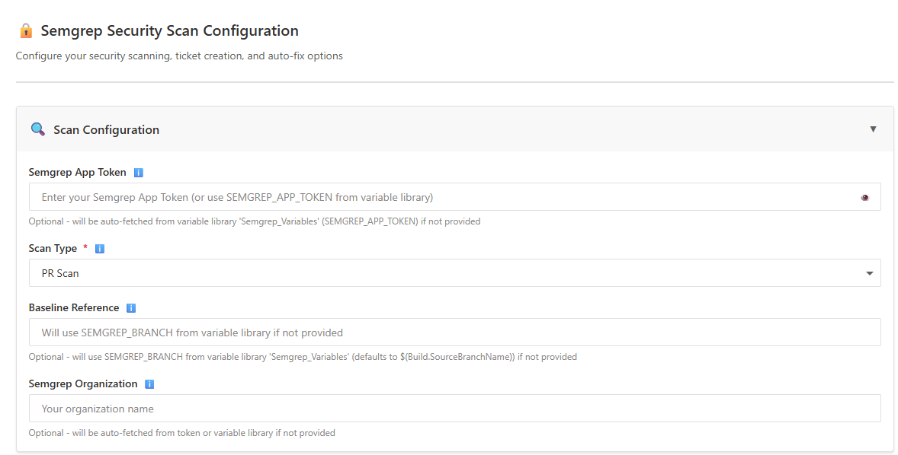
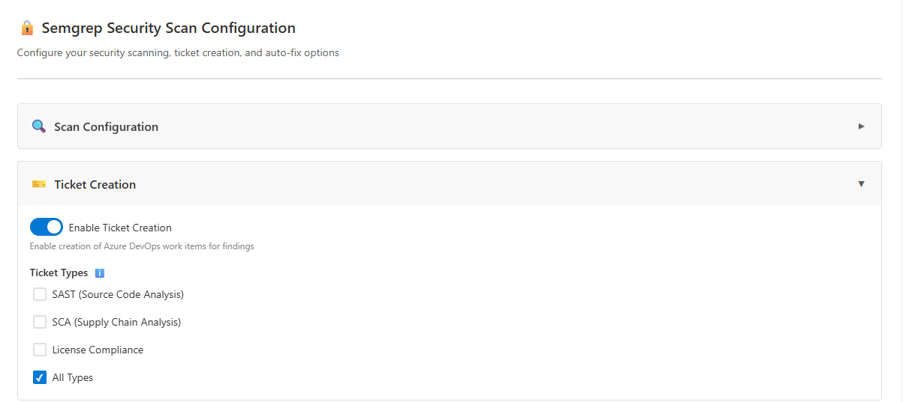
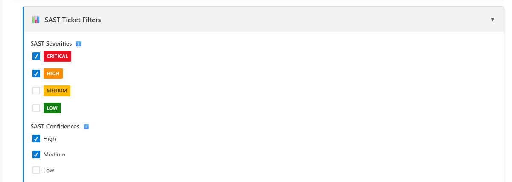
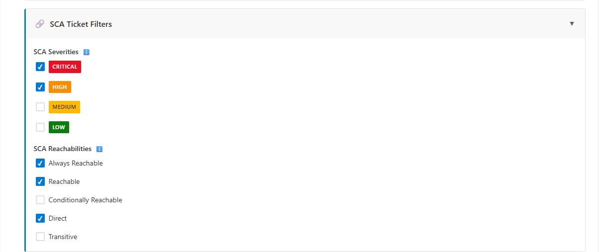
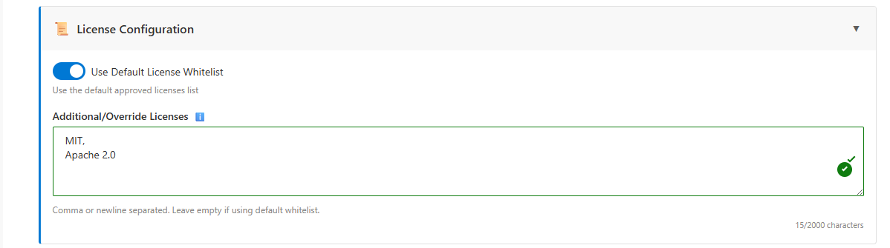
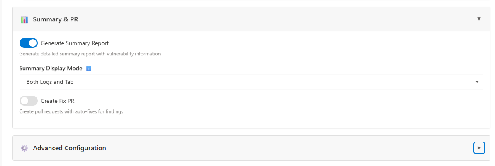

# Semgrep Azure DevOps Extension

A comprehensive Azure DevOps pipeline extension for Semgrep security scanning with advanced ticket creation, summary reporting, auto-fix PR capabilities, and enterprise-grade error handling.

## Get it For Free on Azure MarketPlace
- https://marketplace.visualstudio.com/items?itemName=YashMishrar00thunter.semgrep-security-scan

## 📸 Screenshots

### Scan Configuration


### Ticket Type Selection
Select ticketing options: SAST, SCA, License, or All


### SAST Ticket Creation
SAST Ticket creation based on Severity and Confidence


### SCA Ticket Creation
SCA Ticket creation based on Severity and Reachability


### License Ticket Creation
License Ticket creation for licenses apart from whitelisted licenses


### Auto-Fix PR and Summary Configuration
Auto-Fix PR generation and summary configuration


## 🎯 Features

### Core Functionality
- 🔍 **Flexible Scanning**: Choose between PR Scan (differential) or Full Scan
- 🎫 **Configurable Ticket Creation**: Create Azure DevOps work items for SAST, SCA, and License findings
- 📊 **Comprehensive Summary**: Detailed vulnerability reports with code samples and fix suggestions
- 🔧 **Auto-Fix PRs**: Automatically create pull requests with fixes for identified vulnerabilities

### Advanced Filtering
- **SAST**: Filter by severity (Critical, High, Medium, Low) and confidence (High, Medium, Low)
- **SCA**: Filter by severity and reachability (Always Reachable, Reachable, Direct, Transitive)
- **License**: Global default whitelist with override option for approved licenses

### Enterprise Features
- ✅ **Advanced Error Recovery**: Automatic retry with exponential backoff, rate limit handling
- ⚡ **Performance Optimizations**: Deployment slug caching, batch API calls
- 🛡️ **Partial Failure Handling**: Continues processing even if some operations fail

### 🎨 Beautiful UI (Version 1.1.0+)
- **Modern Form Interface**: Beautiful, fully functional form-based UI for configuration
- **Accessibility**: WCAG 2.1 AA compliant with full keyboard navigation and screen reader support
- **Real-time Validation**: Instant feedback with comprehensive field validation
- **Export/Import**: Save and load configurations as JSON files
- **Preview Modal**: Preview configuration before saving
- **Auto-save**: Automatic state preservation with restore capability
- **Keyboard Shortcuts**: Power user features (Ctrl+S, Ctrl+P, Ctrl+E)
- **Responsive Design**: Works seamlessly on desktop, tablet, and mobile devices
- **Smart Tooltips**: Context-aware help with keyboard accessibility

## 📦 Installation

### Prerequisites
- Azure DevOps organization (example)
- Semgrep account with API token
- Python 3.8+ (available on pipeline agents)
- Four custom fields on **Task** for ticket creation (see setup Step 2 below)

### Upload Extension

1. Download the latest extension package from the repo root (e.g. `YashMishrar00thunter.semgrep-security-scan-1.2.18.vsix`) or build with `npm run package`
2. Go to your Azure DevOps organization: `https://dev.azure.com/`
3. Navigate to: **Organization Settings** → **Extensions** → **Manage Extensions**
4. Click **Upload new extension**
5. Select the `.vsix` file
6. Accept the terms and install

## 🔐 Before you set up the pipeline — Library variable group

**Never put tokens in `azure-pipelines.yml`.** Create a variable group in **Pipelines → Library** before configuring the task or exporting YAML.

### Step 1 — Create the `Semgrep` variable group

1. In Azure DevOps, go to **Pipelines → Library**
2. Click **+ Variable group**
3. Name it **`Semgrep`** (must match the YAML below)
4. Add these **secret** variables (click the lock icon for each):

| Variable | Value | Secret? |
|----------|--------|---------|
| `semgrep_token` | Your Semgrep API token | ✅ Yes |
| `adoPat` | Azure DevOps PAT (Work Items Read & Write scope) | ✅ Yes |

5. Save the variable group
6. Under **Pipeline permissions**, allow your pipeline to use this group

### Step 2 — Create custom fields on Task (required for ticket creation)

If **Enable Ticket Creation** is on, Azure DevOps must have four custom fields on the **Task** work item type. Without them, work item create and duplicate detection fail with errors like `TF51535: Cannot find field Custom.TaskSeverity`.

**To create them:**

1. Go to **Organization Settings → Boards → Process**
2. Find the process your project uses
3. If it's a system process (Agile, Scrum, CMMI, Basic), click **Create inherited process**
4. Open the inherited process
5. Select the **Task** work item type
6. Click **New field** and create:

| Name | Type | Reference Name |
|------|------|----------------|
| Task Severity | String | `Custom.TaskSeverity` |
| Repository | String | `Custom.Repository` |
| Task Source | String | `Custom.TaskSource` |
| Ticket Type | String | `Custom.TicketType` |

Azure DevOps automatically generates the `Custom.*` reference names when you create custom fields in an inherited process.

7. Assign the inherited process to your project: **Project Settings → Overview → Process** (if you created a new inherited process)

### Step 3 — Pipeline YAML

Use **Copy Pipeline YAML** in **Project → Semgrep → Scan Configuration**. It outputs the same structure as [`azure-pipelines.yml`](azure-pipelines.yml) in this repo, with your hub values filled in. Secrets always use Library macros — never paste real tokens into YAML.

```yaml
trigger:
- main

pool:
  vmImage: 'ubuntu-latest'

variables:
- group: Semgrep

steps:

- bash: |
    echo "Verifying System.AccessToken..."
    if [ -z "$SYSTEM_ACCESSTOKEN" ]; then
      echo "System.AccessToken is not available"
      exit 1
    fi
    echo "System.AccessToken is available"
  env:
    SYSTEM_ACCESSTOKEN: $(System.AccessToken)

- task: SemgrepSecurityScan@1
  inputs:
    semgrepAppToken: '$(semgrep_token)'
    scanType: 'Full Scan'

    # Option 1 - Use PAT from Variable Group
    adoPat: '$(adoPat)'

    adoOrganization: 'your-org'
    adoProject: 'YourProject'
    adoTeam: 'Your Team'

    sastSeverities: 'Critical,High,Medium,Low'
    sastConfidences: 'High,Medium,Low'
    scaSeverities: 'Critical,High,Medium,Low'
    scaReachabilities: 'Always Reachable,Reachable,Conditionally Reachable,Direct,Transitive'

    deploymentId: 'YOUR_DEPLOYMENT_ID'
    logLevel: 'DEBUG'
```

Replace `your-org`, `YourProject`, `Your Team`, and `YOUR_DEPLOYMENT_ID` with your values (from the Semgrep hub or Semgrep AppSec Platform → Settings → General).

Azure DevOps expands `$(semgrep_token)` and `$(adoPat)` at runtime from the Library group. Values are **masked in logs** and must **not** be committed to git.

### Step 4 — Pipeline editor (optional)

If you configure the task in the native pipeline UI instead of YAML, type the **Library macros** in the secret fields — not raw tokens:

```text
$(semgrep_token)
$(adoPat)
```

### ❌ Do not do this

Never commit real Semgrep tokens or Azure DevOps PATs in YAML, JSON, or README:

```yaml
semgrepAppToken: '<paste-your-real-token-here>'  # NEVER
adoPat: '<paste-your-real-pat-here>'             # NEVER
```

Use **Copy Pipeline YAML** in the Semgrep config hub — it always emits `'$(semgrep_token)'` and `'$(adoPat)'`.

---

## 🚀 Usage

Configure options in **Project → Semgrep → Scan Configuration**, then export **`azure-pipelines.yml`** via **Copy Pipeline YAML**. The exported file includes only the task inputs shown in the template above; additional settings (ticket routing, summary, PR) use task defaults or can be added manually to YAML if needed.

For a working example, see [`azure-pipelines.yml`](azure-pipelines.yml) in this repository (replace org/project/deployment values with your own).

## 📋 Input Parameters

### Scan Configuration
| Parameter | Type | Required | Default | Description |
|-----------|------|----------|---------|-------------|
| `deploymentId` | string | ✅ Yes | - | Semgrep Cloud deployment ID |
| `scanType` | pickList | ✅ Yes | "Full Scan" | "PR Scan" or "Full Scan" |
| `baselineRef` | string | No | "origin/master" | Baseline reference for PR scans |
| `semgrepAppToken` | string | ✅ Yes | - | Library secret `semgrep_token` — use `'$(semgrep_token)'` in YAML |
| `adoPat` | string | No | - | Library secret `adoPat` — use `'$(adoPat)'` in YAML |
| `adoOrganization` | string | No | - | Azure DevOps organization for ticket routing |
| `adoProject` | string | No | - | Azure DevOps project for ticket routing |
| `logLevel` | pickList | No | "INFO" | DEBUG, INFO, WARNING, ERROR |

### Ticket Creation
| Parameter | Type | Required | Default | Description |
|-----------|------|----------|---------|-------------|
| `enableTicketCreation` | boolean | No | true | Enable work item creation |
| `ticketTypes` | multiSelect | No | "All" | SAST, SCA, License, or All |

### SAST Filters
| Parameter | Type | Required | Default | Description |
|-----------|------|----------|---------|-------------|
| `sastSeverities` | multiSelect | No | "Critical,High" | Severity levels to include |
| `sastConfidences` | multiSelect | No | "High,Medium" | Confidence levels to include |

### SCA Filters
| Parameter | Type | Required | Default | Description |
|-----------|------|----------|---------|-------------|
| `scaSeverities` | multiSelect | No | "Critical,High" | Severity levels to include |
| `scaReachabilities` | multiSelect | No | "Always Reachable,Reachable,Direct" | Reachability types to include |

### License Configuration
| Parameter | Type | Required | Default | Description |
|-----------|------|----------|---------|-------------|
| `useDefaultLicenseWhitelist` | boolean | No | true | Use global default whitelist |
| `licenseWhitelistOverride` | multiLine | No | - | Additional licenses (comma/newline separated) |

### Summary & PR
| Parameter | Type | Required | Default | Description |
|-----------|------|----------|---------|-------------|
| `generateSummary` | boolean | No | true | Generate summary report |
| `summaryDisplayMode` | pickList | No | "Both" | "Logs Only", "Tab Only", or "Both" |
| `createFixPR` | boolean | No | false | Create PRs with auto-fixes |
| `fixPRBranchPrefix` | string | No | "semgrep-fixes/" | Branch prefix for fix PRs |
| `groupFixPRsByType` | boolean | No | true | Group fixes by rule type |

### Work Item Routing
| Parameter | Type | Required | Default | Description |
|-----------|------|----------|---------|-------------|
| `useAdoIterationApi` | boolean | No | true | Fetch current sprint from Azure DevOps API |
| `adoTeam` | string | No | - | Team for iteration lookup (e.g. Engineering) |
| `defaultIterationPath` | string | No | - | Fallback iteration path if API lookup fails |
| `defaultAreaPath` | string | No | - | Fallback area path for work items |

When **Enable Ticket Creation** is on, configure routing in **Project → Semgrep → Scan Configuration** or in YAML. The recommended approach is to enable **Fetch Current Sprint from Azure DevOps API** and set fallback iteration/area paths from **Project Settings → Teams**.

| Field | Where to find it |
|-------|------------------|
| `defaultIterationPath` | Project Settings → Teams → **Iterations** |
| `defaultAreaPath` | Project Settings → Project configuration → **Areas** |

---

## 📊 Outputs

### Summary Report
- **Markdown Format**: Displayed in pipeline logs and saved as artifact
- **Test Results Format**: JSON format saved as artifact (for tab view)
- **Location**: `semgrep-summary/` artifact directory

### Metrics
- **Metrics File**: `semgrep_metrics.json` (saved to working directory)
- **Includes**: Scan stats, ticket creation stats, PR stats, performance metrics

### Work Items
- Created in Azure DevOps with:
  - Links to PR (if applicable)
  - Links to Semgrep findings
  - Code locations
  - Severity and confidence information
  - HTML descriptions with details

### Pull Requests
- Created when `createFixPR=true` and findings have autofix code
- Branch pattern: `{fixPRBranchPrefix}{rule-type}-{timestamp}`
- Includes fix descriptions and links to findings

## 🏗️ Project Structure

```
semgrep_ado_ext/
├── extension/
│   ├── tasks/
│   │   └── semgrepScan/          # Main task
│   │       ├── task.json         # Task definition
│   │       ├── task.ts           # TypeScript implementation
│   │       ├── task.js           # Compiled JavaScript
│   │       └── scripts/          # Python scripts (copied during build)
│   │           ├── scan_executor.py
│   │           ├── ticket_creator.py
│   │           ├── summary_generator.py
│   │           ├── pr_creator.py
│   │           ├── api_utils.py
│   │           ├── metrics.py
│   │           └── requirements.txt
│   ├── scripts/                  # Source Python scripts
│   ├── ui/                      # UI components (future)
│   └── icons/                   # Extension icons
├── scripts/
│   └── copy-scripts.js          # Build script
├── package.json                 # Node.js dependencies
├── tsconfig.json                # TypeScript configuration
├── vss-extension.json           # Extension manifest
└── README.md                    # This file
```

## 🛠️ Development

### Prerequisites
- Node.js 16+ and npm
- Python 3.8+
- TypeScript 5+
- tfx-cli (for packaging)

### Setup

1. **Install dependencies**:
   ```bash
   npm install
   ```

2. **Build the extension**:
   ```bash
   npm run build
   ```
   This compiles TypeScript and copies Python scripts to the task directory.

3. **Package the extension**:
   ```bash
   npm run package
   ```
   This creates the `.vsix` file in the root directory.

### Scripts

- `npm run build` - Compile TypeScript and copy scripts
- `npm run package` - Build and package extension
- `npm run copy-scripts` - Copy Python scripts to task directory

## 🔧 How It Works

### Execution Flow

1. **Scan Execution** (10-30%)
   - Runs Semgrep CLI (full or PR scan)
   - Outputs findings.json
   - Validates scan completion

2. **Ticket Creation** (30-60%) - Optional
   - Fetches findings from Semgrep API
   - Applies filters (severity, confidence, reachability)
   - Creates Azure DevOps work items
   - Links to PRs and Semgrep findings

3. **Summary Generation** (60-85%) - Optional
   - Fetches detailed finding information
   - Generates markdown summary
   - Generates test results format
   - Publishes as artifacts

4. **PR Creation** (85-95%) - Optional
   - Finds findings with autofix code
   - Creates branches and applies fixes
   - Creates pull requests via Azure DevOps API

5. **Completion** (95-100%)
   - Finalizes metrics
   - Reports success/failure

### Error Handling

- **Critical Errors**: Scan failures stop the pipeline
- **Non-Critical Errors**: Ticket/PR/Summary failures log warnings but continue
- **Retry Logic**: Automatic retries with exponential backoff for API calls
- **Rate Limits**: Automatic handling with Retry-After header support
- **Partial Failures**: Continues processing even if some items fail

## 📈 Metrics

The extension collects comprehensive metrics:

- **Scan Metrics**: Findings count, scan duration, scan type
- **Ticket Metrics**: Created/skipped/failed counts per type
- **PR Metrics**: PRs created, findings fixed, branches created
- **Summary Metrics**: Findings included, output formats
- **Performance**: Total duration, per-step durations

Metrics are saved to `semgrep_metrics.json` and can be published as artifacts.

## 🔐 Security

- **Token Storage**: Use Azure DevOps secure variables for `semgrepAppToken`
- **OAuth Token**: Enable "Allow scripts to access OAuth token" for Azure DevOps API access
- **No Hardcoded Secrets**: All sensitive data via environment variables

## 🐛 Troubleshooting

### Common Issues

1. **Python not found**
   - Ensure Python 3.8+ is available on the agent
   - Add Python installation step if needed

2. **API Authentication Failed**
   - Verify `SEMGREP_APP_TOKEN` is correct
   - Check token has necessary permissions

3. **Ticket Creation Fails**
   - Verify the four custom Task fields exist (see **Step 2 — Create custom fields on Task**)
   - Verify `adoPat` in the Library group has **Work Items (Read & Write)** scope
   - Verify `SYSTEM_ACCESSTOKEN` is available
   - Enable "Allow scripts to access OAuth token" in pipeline options

4. **Rate Limit Errors**
   - Extension automatically retries with backoff
   - Check logs for retry attempts

5. **CSV Files Not Found**
   - Extension uses fallback defaults
   - Verify CSV URLs are accessible

## 📚 Documentation

Additional documentation available in the `docs/` directory:

- **Implementation Details**: See `docs/` folder for detailed documentation
- **Configuration Examples**: See usage examples above
- **API Reference**: Semgrep API documentation at https://semgrep.dev/api

## 🎯 Use Cases

### PR Security Review
```yaml
- task: SemgrepSecurityScan@1
  inputs:
    scanType: 'PR Scan'
    enableTicketCreation: true
    ticketTypes: 'SAST,SCA'
    sastSeverities: 'Critical,High'
    generateSummary: true
    createFixPR: true
```

### Full Repository Scan
```yaml
- task: SemgrepSecurityScan@1
  inputs:
    scanType: 'Full Scan'
    enableTicketCreation: true
    ticketTypes: 'All'
    generateSummary: true
```

### License Compliance Check
```yaml
- task: SemgrepSecurityScan@1
  inputs:
    scanType: 'Full Scan'
    enableTicketCreation: true
    ticketTypes: 'License'
    useDefaultLicenseWhitelist: true
```

## ✅ Status

**Production Ready** - All core features, enhancements, and UI implemented and tested.

- ✅ Scan execution (Full & PR)
- ✅ Ticket creation (SAST, SCA, License)
- ✅ Summary generation
- ✅ Auto-fix PR creation
- ✅ Advanced error recovery
- ✅ Performance optimizations
- ✅ Metrics and reporting
- ✅ Beautiful UI interface (v1.1.0+)
- ✅ Full accessibility support (v1.1.0+)
- ✅ Advanced validation (v1.1.0+)

## 📄 License

MIT License - See [LICENSE](./LICENSE) file for details.

## 👥 Support

For issues, questions, or contributions:
- Check the documentation in the `docs/` directory
- Review pipeline logs for detailed error messages
- Contact the development team

## 🔄 Version History

- **1.1.0** (Current)
  - Beautiful form-based UI interface
  - Full accessibility support (WCAG 2.1 AA)
  - Advanced validation and user experience features
  - Export/import configuration
  - Auto-save/restore functionality
  - Keyboard shortcuts and smart tooltips
  - Responsive design and performance optimizations

- **1.0.0**
  - Initial release
  - All core features implemented
  - Advanced error recovery and performance optimizations
  - Metrics and reporting

---

## 👤 Author

**Yash Mishra** (AKA Lucifer)

---

**Powered by Semgrep**
